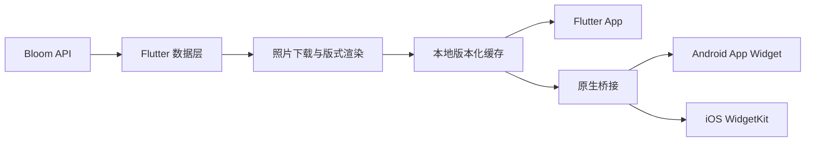

# Bloom Flutter

Bloom 是一款面向 Android 与 iOS 的照片展示应用。它将服务端下发的照片、标题和拍摄信息渲染为统一的视觉卡片，并同步展示在 App 与桌面小组件中。

项目采用 Flutter 构建共享业务与界面，同时通过原生桥接分别接入 Android App Widgets、AlarmManager 和 iOS WidgetKit、App Groups。当前版本重点解决了熄屏、App 进程退出后的小组件轮播，以及 App 与小组件之间的内容一致性。

> 当前版本：`1.0.9` · Flutter `3.29.3` · Dart `3.7.2`

## 核心功能

- **推荐模式**：按服务端推荐结果展示每日照片。
- **轮播模式**：支持 15 分钟、30 分钟、1 小时至每天一次等间隔。
- **活跃时段**：可配置每日轮播开始和结束时间，默认 `06:00–22:00`。
- **桌面小组件**：Android 支持纵向、2×2 方形和 4×4 方形；iOS 支持小号与大号 WidgetKit 小组件。
- **统一视觉渲染**：照片、中文/英文标题、拍摄日期和地点由 App 预渲染为各尺寸成品图。
- **App/小组件同步**：App 与小组件共享当前照片、模式和元数据，避免两处内容不一致。
- **离线优先显示**：成功下载和渲染后的图片保存在本地；网络异常时保留最近一次有效内容。
- **设备配对**：设备注册后通过配对码与服务端照片资源建立关联。
- **配置持久化**：轮播模式、间隔和活跃时段在升级安装后继续保留。

## 工作方式



轮播模式不会等到切换时再下载大图。App 会提前取得一组轮播计划，下载并渲染未来条目，再将本地图片路径和展示时间交给系统小组件框架。这样即使 App 已退出、设备熄屏，小组件也无需临时启动 Flutter 或依赖即时网络请求。

### 平台刷新策略

| 平台 | 主要机制 | App 退出后的刷新方式 | 恢复机制 |
| --- | --- | --- | --- |
| Android | AppWidgetProvider + AlarmManager | 使用 `setExactAndAllowWhileIdle` 定时唤醒系统小组件 Provider，并切换预渲染本地图片 | WorkManager 周期同步；缺少缓存时联网补齐 |
| iOS | WidgetKit + App Groups | WidgetKit 读取 App 预生成的本地 timeline，在对应时间展示条目 | App 再次进入前台时刷新计划与共享缓存 |

Android 的精确轮播需要用户允许“闹钟和提醒”权限。iOS 的实际刷新时间由 WidgetKit 调度，系统可能根据电量和使用情况做少量调整；重新亮屏后应显示当前时间对应的最新条目。

## 项目结构

```text
.
├── lib/
│   ├── core/api/                 # 服务端 API 客户端
│   ├── core/models/              # 配对、设备、照片与轮播模型
│   ├── core/rendering/           # 多尺寸照片卡片渲染
│   ├── core/storage/             # 缓存、身份与显示配置
│   ├── platform/                 # Flutter 到原生小组件桥接
│   ├── background_sync.dart      # Android 后台同步入口
│   └── ui/                       # App 主界面与交互
├── android/
│   └── app/src/main/             # Android Provider、闹钟与 RemoteViews
├── ios/
│   ├── Runner/                   # iOS 宿主与 App Group 数据桥接
│   └── BloomWidgets/             # WidgetKit Extension 与 timeline
├── packages/
│   ├── bloom_widget_bridge/      # 双端原生 MethodChannel 插件
│   └── liquid_glass_easy/        # 本地液态玻璃界面组件
└── test/                         # API 与设备身份单元测试
```

## 技术栈

- Flutter / Dart
- Android Kotlin、App Widgets、RemoteViews、AlarmManager、WorkManager
- iOS Swift、WidgetKit、App Groups、Keychain
- `http`、`shared_preferences`、`flutter_secure_storage`
- 本地自维护插件 `bloom_widget_bridge`

## 开发环境

| 工具 | 建议版本或要求 |
| --- | --- |
| Flutter | `3.29.3` stable |
| Dart | `3.7.2` |
| Android | Flutter 当前 stable 对应的 Android SDK；真机测试建议 Android 12+ |
| iOS App | iOS 14+ |
| iOS Widget Extension | iOS 15+ |
| Xcode | 支持目标 iOS SDK 且可完成真机签名的版本 |

## 开始开发

### 1. 获取项目

```bash
git clone https://github.com/MemoryHub/bloom-flutter.git
cd bloom-flutter
flutter pub get
```

### 2. 检查环境

```bash
flutter doctor -v
flutter analyze
flutter test
```

### 3. 运行 Android

```bash
flutter run -d <android-device-id>
```

在需要 15 分钟等精确轮播时，请在手机系统设置中允许 Bloom 使用“闹钟和提醒”。部分 Android 厂商还会提供自启动或后台运行控制，真机验收应覆盖熄屏和手动划掉 App 后的场景。

### 4. 运行 iOS

```bash
cd ios
pod install
cd ..
flutter run -d <ios-device-id>
```

iOS 真机运行前，需要在 Xcode 中为 Runner 和 BloomWidgets Extension 配置同一开发团队，并保证两者启用相同的 App Group。当前工程使用：

```text
group.com.zhangbo.bloom.zb20260815
```

若更换 Bundle Identifier 或开发团队，请同步修改：

- Runner 与 BloomWidgets 的 Signing & Capabilities
- `ios/Runner/Runner.entitlements`
- `ios/BloomWidgets/BloomWidgets.entitlements`
- Xcode 工程中的 App Group 标识

## 服务端配置

默认 API 地址定义在 `lib/core/api/bloom_api_client.dart`：

```text
https://bloom.jihu.top
```

客户端依赖服务端提供设备注册、配对状态、每日推荐、轮播计划和照片下载接口。切换测试或生产环境时，应通过构造 `BloomApiClient` 时传入 `baseUrl`，并确保服务端返回的轮播时间与设备时区一致。

## 构建

### Android APK

```bash
flutter build apk --release
```

### iOS

```bash
flutter build ios --release
```

iOS Release 构建仍需有效的 Apple Developer 签名、Bundle Identifier、Widget Extension 和 App Group 配置。

## 真机验收建议

1. 完成设备配对并确认照片在 App 内正常显示。
2. 添加目标尺寸的小组件，确认 App 与小组件显示同一条内容。
3. 切换到轮播模式并选择 15 分钟间隔。
4. 等待未来图片完成预加载后退出 App。
5. 手动划掉 App、熄屏，并保持设备不充电。
6. 到达下一轮播时间后直接亮屏查看桌面，不先点击小组件。
7. 连续验证至少两个轮播周期，并再次打开 App 检查内容是否与小组件一致。

## 数据与安全

- 设备身份和配对信息通过平台安全存储能力维护。
- iOS 的 App 与 Widget Extension 仅通过专属 App Group 共享必要状态和本地图片路径。
- 仓库不提交本机 SDK 路径、构建产物、CocoaPods 目录、签名证书、Provisioning Profile 或密钥文件。
- 照片缓存保存在应用私有目录，卸载应用后由系统清除。

## 质量检查

提交代码前建议执行：

```bash
flutter analyze
flutter test
```

涉及小组件调度、App Group、签名或 Android 厂商后台策略的改动，必须补充 Android 与 iOS 真机验证；模拟器测试不能完全覆盖熄屏和进程退出后的系统调度行为。
