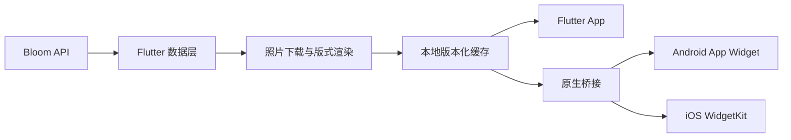

# Bloom Flutter

Bloom 是一款面向 Android 与 iOS 的照片展示应用。它将服务端下发的照片、标题和拍摄信息渲染为统一的视觉卡片，并同步展示在 App 与桌面小组件中。

项目采用 Flutter 构建共享业务与界面，同时通过原生桥接分别接入 Android App Widgets、AlarmManager 和 iOS WidgetKit、App Groups。当前版本重点解决了熄屏、App 进程退出后的小组件轮播，以及 App 与小组件之间的内容一致性。

> 当前版本：`1.0.9` · Flutter `3.29.3` · Dart `3.7.2`

## 核心功能

- **推荐模式**：按服务端推荐结果展示每日照片。
- **轮播模式**：支持 15 分钟、30 分钟、1 小时至每天一次等间隔。
- **活跃时段**：可配置每日轮播开始和结束时间，默认 `06:00–22:00`。
- **桌面小组件**：Android 支持纵向、2×2 方形和 4×4 方形；iOS 支持小号与大号 WidgetKit 小组件。
- **统一视觉渲染**：照片、中文/英文标题、拍摄日期和地点由 App 预渲染为各尺寸成品图。
- **App/小组件同步**：App 与小组件共享当前照片、模式和元数据，避免两处内容不一致。
- **离线优先显示**：成功下载和渲染后的图片保存在本地；网络异常时保留最近一次有效内容。
- **设备配对**：设备注册后通过配对码与服务端照片资源建立关联。
- **配置持久化**：轮播模式、间隔和活跃时段在升级安装后继续保留。

## 工作方式


```mermaid
flowchart LR
    A[Bloom API] --> B[Flutter 数据层]
    B --> C[照片下载与版式渲染]
    C --> D[本地版本化缓存]
    D --> E[Flutter App]
    D --> F[原生桥接]
    F --> G[Android App Widget]
    F --> H[iOS WidgetKit]
```

轮播模式不会等到切换时再下载大图。App 会提前取得一组轮播计划，下载并渲染未来条目，再将本地图片路径和展示时间交给系统小组件框架。这样即使 App 已退出、设备熄屏，小组件也无需临时启动 Flutter 或依赖即时网络请求。

### 平台刷新策略

| 平台 | 主要机制 | App 退出后的刷新方式 | 恢复机制 |
| --- | --- | --- | --- |
| Android | AppWidgetProvider + AlarmManager | 使用 `setExactAndAllowWhileIdle` 定时唤醒系统小组件 Provider，并切换预渲染本地图片 | WorkManager 周期同步；缺少缓存时联网补齐 |
| iOS | WidgetKit + App Groups | WidgetKit 读取 App 预生成的本地 timeline，在对应时间展示条目 | App 再次进入前台时刷新计划与共享缓存 |

Android 的精确轮播需要用户允许“闹钟和提醒”权限。iOS 的实际刷新时间由 WidgetKit 调度，系统可能根据电量和使用情况做少量调整；重新亮屏后应显示当前时间对应的最新条目。

## 项目结构

```text
.
├── lib/
│   ├── core/api/                 # 服务端 API 客户端
│   ├── core/models/              # 配对、设备、照片与轮播模型
│   ├── core/rendering/           # 多尺寸照片卡片渲染
│   ├── core/storage/             # 缓存、身份与显示配置
│   ├── platform/                 # Flutter 到原生小组件桥接
│   ├── background_sync.dart      # Android 后台同步入口
│   └── ui/                       # App 主界面与交互
├── android/
│   └── app/src/main/             # Android Provider、闹钟与 RemoteViews
├── ios/
│   ├── Runner/                   # iOS 宿主与 App Group 数据桥接
│   └── BloomWidgets/             # WidgetKit Extension 与 timeline
├── packages/
│   ├── bloom_widget_bridge/      # 双端原生 MethodChannel 插件
│   └── liquid_glass_easy/        # 本地液态玻璃界面组件
└── test/                         # API 与设备身份单元测试
```

## 界面设计语言

App 的视觉语言是**墨 + 纸**两种材质：一面灰黑的墙（`#1D2427 → #161C1E → #0C1012` 渐变 + 纸纹），上面只有一种形状（直角长方形 + 5px 圆角），唯一的线是行与行之间的分隔线。

**两种材质按"你在对它做什么"分工：**

| 材质 | 用在哪 | 理由 |
| --- | --- | --- |
| **纸**（乳白 `#FDFBF7` + 纸纹 + 亮顶边 + 暗底边 + 阴影，深色墨水文字） | 首页信纸照片卡、设备列表的 tile | 纸 = **内容**，是你"看"的东西；也是桌面小组件的那张纸 |
| **墨**（深色面板 `#272F31`，浅色文字） | 设备详情的「刷新节奏」、配对卡片等 | 墨 = **设置**，是你"操作"的东西 |

结果就是：全 App 最亮的东西恰好是最重要的两样（照片、设备），这正是"暗房里挂照片"该有的样子。

| 概念 | 位置 | 说明 |
| --- | --- | --- |
| `BloomInk` | `lib/ui/bloom_glass_home.dart` | 唯一色彩来源：墙 `#171B19→#0A0C0B`（灰绿黑）、面板 `#1E2422`（阳）、凹槽 `#0E1211`（阴）、分隔线 `#2A302D`、文字三档（`#EDF2EF` 100% / 62% / 38%）、反白填充、唯一彩色 `accent #8FA99C`（灰绿）+ `accentDeep #2C3A34` |
| `BloomSurface` | 同上 | 几何：圆角 **5px**（内块 3 / 控件 5）、行高 56、页面 inset 16、发丝线缩进 56 |
| `BloomType` | 同上 | 字阶：页面标题（宋体 26·w600）／行标题（15·w500）／标签（11·字距 1.1）／元信息（11.5·w400）／正文（13.5·w400·行高 1.55）／读数（15·w600）／编码（24·字距 3） |
| `BloomPanel` | 同上 | 唯一的"面板"：暖黑纸面 + 顶部 1px 亮边（`_PanelPainter`），一屏最多一个 |
| `BloomPrimaryButton` | 同上 | 反白（暖白底 + 墨色字），深色页面上最强的形状；一屏最多一个 |
| `BloomDeviceDial` / `BloomIconButton` | 同上 | 头部控件：34px 直角方形 + 1px 亮发丝线（`controlEdge`），无填充。设备切换是**自绘点阵圆环**（12 点，正上方一点着主题绿），不带文字 |
| `BloomRowDivider` | 同上 | 全 App 唯一的线，只做"行与行的分隔"，永远不做外框 |

规则：

- **玻璃只留给真正悬浮在照片之上的东西**——底部导航栏（深色版）和顶部消息条。其余一律是墨底面板。
- **不用纯黑**。`#000` 在 OLED 上像一个洞，且"没有材质"；墙用**灰绿黑**，并且**带纸张颗粒**（三层：暗点 / 亮点 / 纤维，见 `_PaperGrainPainter`）。
- **阴阳两种深度都有语义**：浮起（有亮边 + 投影）= "存在的东西"；内凹（纯凹槽）= "空位 / 将来"。设备卡是阳，卡里的图标位和"添加设备"是阴。
- **层级靠排版，不靠颜色和边框**。所以：正文一律 regular（w400），只有 display 标题、按钮和"读数"才加粗；小字靠**字距**（1.1）而不是加粗；分组靠间距（组间距 26 > 行间 1px 线）。
- **一屏一个面板**。四个区块都做成卡片，等于没有主角。
- **圆角只有 5px**。例外只有两个：首页信纸卡（27，必须和桌面小组件一致）和底部导航胶囊。
- **主操作反白，次操作描边**，`accent` 只用于两处：在线状态点、当前选中项。
- 头部行（模式标签 ⇄ 设备切换）的左右缩进**必须跟着信纸卡的真实宽度算**，不能写死页面 inset——卡片是 `AspectRatio(720/1200)`，矮屏上它会比内容列窄，写死就会"探头"。这条有回归测试。
- 新页面只允许使用上表中的 token，不要新造字号、圆角或颜色。

### 层级只有三层（多一层页面就会"没有重点"）

| 层 | 做法 | 用在哪 |
| --- | --- | --- |
| **浮起**（raise） | 亮顶边 + 暗底边 + 双层阴影 | 一屏**只有一个**，它是这一屏的主题：首页的信纸卡、设备详情页的「刷新节奏」 |
| **凹槽**（well） | `recess` 平涂，无亮边、无阴影 | 一组事实：设备号 / 配对码、小组件状态 |
| **行** | 1px `divider` | 组内的行与行 |

### 字号阶梯只有五档

`18` 区块标题 · `16` read-out 值 · `15` 行文字 · `13.5` 正文说明 · `11.5 / 11` 元信息与字段标签。

值和标签**必须**差一档（都写 15 就是"字体大小都一样，没有侧重点"）。

### 只有一个动作色

鼠尾草绿 `#8FA99C` 既是**主题色**也是**动作色**：所有主按钮（保存、重新生成激活码）统一用它填充、配 `#121614` 文字。
选中态用深一档的 `accentDeep`；实时状态（在线点）用 `accent`，在纸上用 `accentOnPaper`。

### 表单字段 = 标签在上 + 凹槽在下

不用 Material 的浮动标签（它会压在控件自己的线上），也不用描边框：一切可点字段都是「11px 标签 + 52px 凹陷槽 + 右侧 ⌄」，点开底部选项弹层（频率、生效时间都是给几个选项，不给自由输入）。

## 技术栈

- Flutter / Dart
- Android Kotlin、App Widgets、RemoteViews、AlarmManager、WorkManager
- iOS Swift、WidgetKit、App Groups、Keychain
- `http`、`shared_preferences`、`flutter_secure_storage`
- 本地自维护插件 `bloom_widget_bridge`

## 开发环境

| 工具 | 建议版本或要求 |
| --- | --- |
| Flutter | `3.29.3` stable |
| Dart | `3.7.2` |
| Android | Flutter 当前 stable 对应的 Android SDK；真机测试建议 Android 12+ |
| iOS App | iOS 14+ |
| iOS Widget Extension | iOS 15+ |
| Xcode | 支持目标 iOS SDK 且可完成真机签名的版本 |

## 开始开发

### 1. 获取项目

```bash
git clone https://github.com/MemoryHub/bloom-flutter.git
cd bloom-flutter
flutter pub get
```

### 2. 检查环境

```bash
flutter doctor -v
flutter analyze
flutter test
```

### 3. 运行 Android

```bash
flutter run -d <android-device-id>
```

在需要 15 分钟等精确轮播时，请在手机系统设置中允许 Bloom 使用“闹钟和提醒”。部分 Android 厂商还会提供自启动或后台运行控制，真机验收应覆盖熄屏和手动划掉 App 后的场景。

### 4. 运行 iOS

```bash
cd ios
pod install
cd ..
flutter run -d <ios-device-id>
```

iOS 真机运行前，需要在 Xcode 中为 Runner 和 BloomWidgets Extension 配置同一开发团队，并保证两者启用相同的 App Group。当前工程使用：

```text
group.com.zhangbo.bloom.zb20260815
```

若更换 Bundle Identifier 或开发团队，请同步修改：

- Runner 与 BloomWidgets 的 Signing & Capabilities
- `ios/Runner/Runner.entitlements`
- `ios/BloomWidgets/BloomWidgets.entitlements`
- Xcode 工程中的 App Group 标识

## 服务端配置

默认 API 地址定义在 `lib/core/api/bloom_api_client.dart`：

```text
https://bloom.jihu.top
```

客户端依赖服务端提供设备注册、配对状态、每日推荐、轮播计划和照片下载接口。切换测试或生产环境时，应通过构造 `BloomApiClient` 时传入 `baseUrl`，并确保服务端返回的轮播时间与设备时区一致。

## 构建

### Android APK

```bash
flutter build apk --release
```

### iOS

```bash
flutter build ios --release
```

iOS Release 构建仍需有效的 Apple Developer 签名、Bundle Identifier、Widget Extension 和 App Group 配置。

## 真机验收建议

1. 完成设备配对并确认照片在 App 内正常显示。
2. 添加目标尺寸的小组件，确认 App 与小组件显示同一条内容。
3. 切换到轮播模式并选择 15 分钟间隔。
4. 等待未来图片完成预加载后退出 App。
5. 手动划掉 App、熄屏，并保持设备不充电。
6. 到达下一轮播时间后直接亮屏查看桌面，不先点击小组件。
7. 连续验证至少两个轮播周期，并再次打开 App 检查内容是否与小组件一致。

## 数据契约（显示模式）

**模式（推荐 / 轮播）以服务器为准，本地镜像只是它的副本。**

- 每次启动都会调 `GET /api/frame/devices/{id}/status`，服务端**每次都返回 `mode`**（没有设置记录时默认 `carousel`）。App 的 `DeviceStatus.mode` 保留这个字段。
- 若它与本地镜像（`bloom.display_mode`，桌面小组件读的那个）不一致，**以服务器为准**：回写镜像 + 重排后台任务，让服务器、App、桌面小组件三者一致。
  - 为什么必须这样：镜像只由本 App 写入，所以在网页端（bloom.jihu.top）改过的模式永远到不了镜像 —— 镜像才是过期的那一方。曾经的症状就是「首页显示推荐模式，同一台手机的详情页显示轮播模式」。
  - 这条同步**不额外发请求**：`mode` 搭在启动已有的 `/status` 上，所以首页依旧不发任何 `settings` 请求（有测试钉住）。
- **点模式 = 立即保存**（`settings/set`，`target` 为 `mobile`/`eink`），不需要按保存；档位和生效时间是**表单**，仍然要点保存。
  - 点模式时会顺带把当前草稿里的档位一起提交，避免服务器出现"新模式 + 旧档位"的组合。

## 数据与安全

- 设备身份和配对信息通过平台安全存储能力维护。
- iOS 的 App 与 Widget Extension 仅通过专属 App Group 共享必要状态和本地图片路径。
- 仓库不提交本机 SDK 路径、构建产物、CocoaPods 目录、签名证书、Provisioning Profile 或密钥文件。
- 照片缓存保存在应用私有目录，卸载应用后由系统清除。

## 质量检查

提交代码前建议执行：

```bash
flutter analyze
flutter test
```

涉及小组件调度、App Group、签名或 Android 厂商后台策略的改动，必须补充 Android 与 iOS 真机验证；模拟器测试不能完全覆盖熄屏和进程退出后的系统调度行为。
